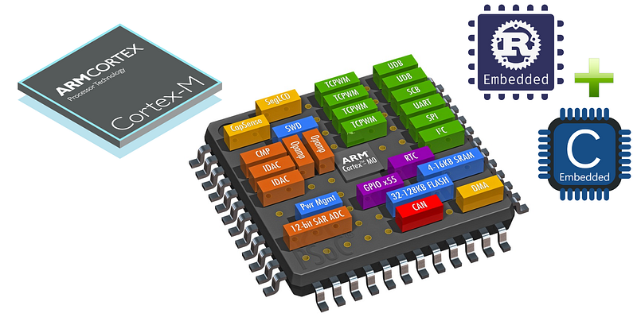
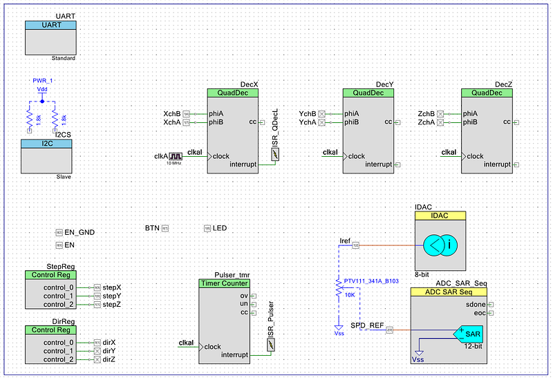

# PSoC 42xx CY8C4245AXI-485

__Project based on [PSOC_RUST](https://github.com/9names/PSOC_Rust/tree/master). for PSoC 5LP__

[Article on Medium](https://medium.com/@juanespaz/embedded-rust-integration-to-existing-c-code-and-projects-part-1-844ee4e39dd9) 
There are two things slowing down the adoption of Rust for Embedded projects,
- Most of the existing projects are written in c/c++ and it makes no sense to spend time and resources in completely rewriting them if they are working as expected.
- The examples and development done for embedded tools is limited to newer ICs (It is growing)

This projects presents a step in between as a way to try rust with known C HALs, or in a modular way, bringing new life to older MCUs or ICs. 

For the example I choose PSoC4 Protoyping kit CY8CKIt-049-42XX, it is a very interesting SoC that integrates Hardware Peripherals that can handle Digital and Analog signals completely independent of the Processor.

I have created a project with PSOC Creator IDE to generate all the HAL C code and integrated it with a Rust application that uses FFIs to interact with the original code.
## 🚀 Advantages
- Modernize modernize existing C projects
- Reusing existing and tested functionality from C / Legacy code
- Use VSCode for development, Linting, code completion and plugins
- Explore Rust FFI and No_STD as a smaller step into **Embedded Rust**
- Benefit from Rust Linting and Static Analisys
- Introduce unit tests to code base with more simplicity 

Like a lot of other MCUs out there this one is old enough and has a very specific architecture even if it has a ARM Cortex M0. This makes it very unlikely to be considered for fully embedded Rust framework developments, HAL, PAC, to be used with Embassy, RTIC, etc. 

Although this allows for a limited use of embedded C libraries it is a simple wayto start exploting Rust NO_STD for embedded and the toolchain, since you can reuse already known functions.

There is also an option to expose rust functions to be used in the C application.

I have written a blog post in Medium explaining some of the process.

the application is not finished yet but the process works.

